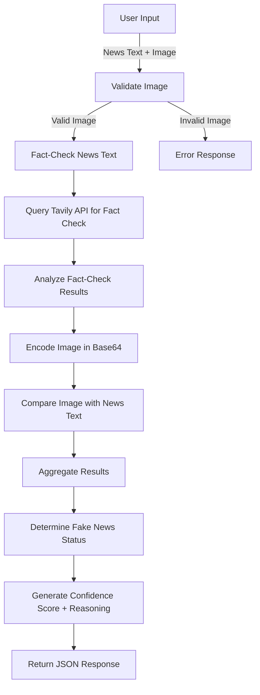

### **Workflow Explanation**

1. **Input from User**:
   - The user provides a news text and an image.
   - These inputs are submitted to the `/analyze` endpoint.

2. **Image Validation**:
   - The system checks the uploaded file to ensure it is an image and validates its size.

3. **Text Analysis**:
   - The system processes the news text.
   - It sends the news text to the Tavily API to retrieve fact-check results.

4. **Fact-Check Results Analysis**:
   - Fact-check results are analyzed for relevance to the provided news text.
   - Each source is scored based on its relevance.

5. **Image-Text Comparison**:
   - The image is encoded in Base64 format.
   - The image and text are compared using a prompt and analyzed by the Together model.

6. **Fake News Analysis**:
   - The results from the fact-checking and image-text comparison are aggregated.
   - Based on the relevance and evidence, the system determines:
     - Fact-check status: "Supported," "Contradicted," or "Inconclusive."
     - Confidence score: A numeric score indicating how strongly the system believes in the analysis.
     - Reasoning: A textual explanation of the decision.

7. **Response to User**:
   - The system returns the analysis results to the user in JSON format.

---

### **Mermaid Diagram**

---

### **Key Components in Workflow**
1. **Validation Layer**:
   Ensures user inputs are correct and in the required format.

2. **Fact-Checking Integration**:
   Leverages external APIs like Tavily to fetch fact-checking sources.

3. **Image-Text Comparison**:
   Uses machine learning to analyze and compare the text and image.

4. **Decision-Making Logic**:
   Aggregates all findings to produce a clear result for the user.
